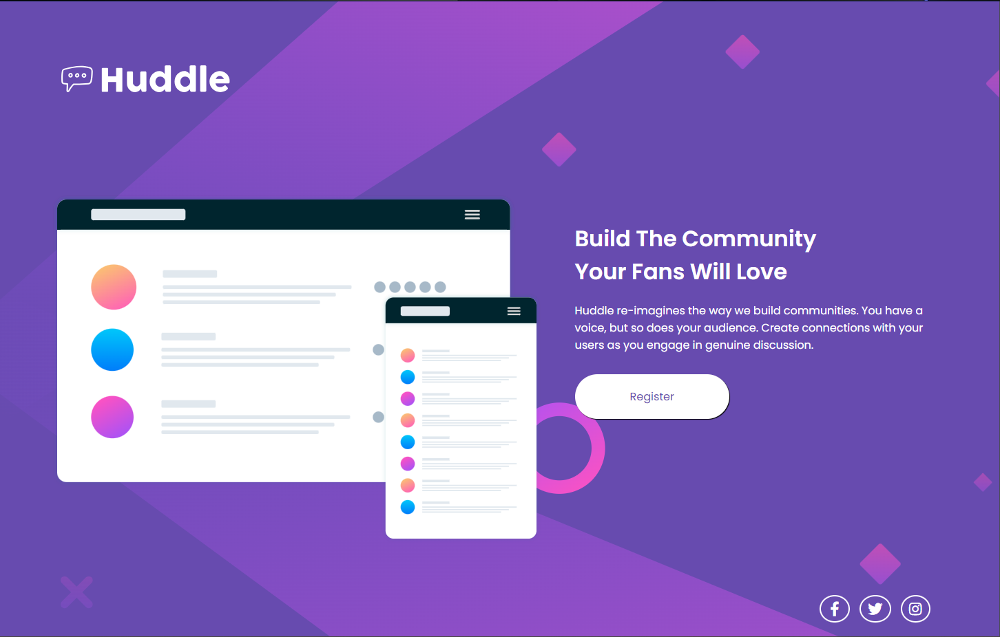

# Quest Dev em Dobro - HTML + CSS

O projeto é um desafio frontend proporcionado pelo Huddle, 
ele possui responsividade para mobile e interação para os links.

## Desktop


## Mobile


## Usando o projeto
Para começar com este projeto, siga estes passos:

1. Clone o repositório:

   ```bash
   git clone https://github.com/franzhanl/quest-html-css.git
2. Instale as dependencias:

    ```bash
    cd quest-html-css
    npm install
3. Inicie o servidor de desenvolvimento:

    ```bash
    npm start
4. Abra seu navegador e vá para http://localhost:3000 para visualizar o site.
## Tecnologias Utilizadas

- HTML
- CSS
